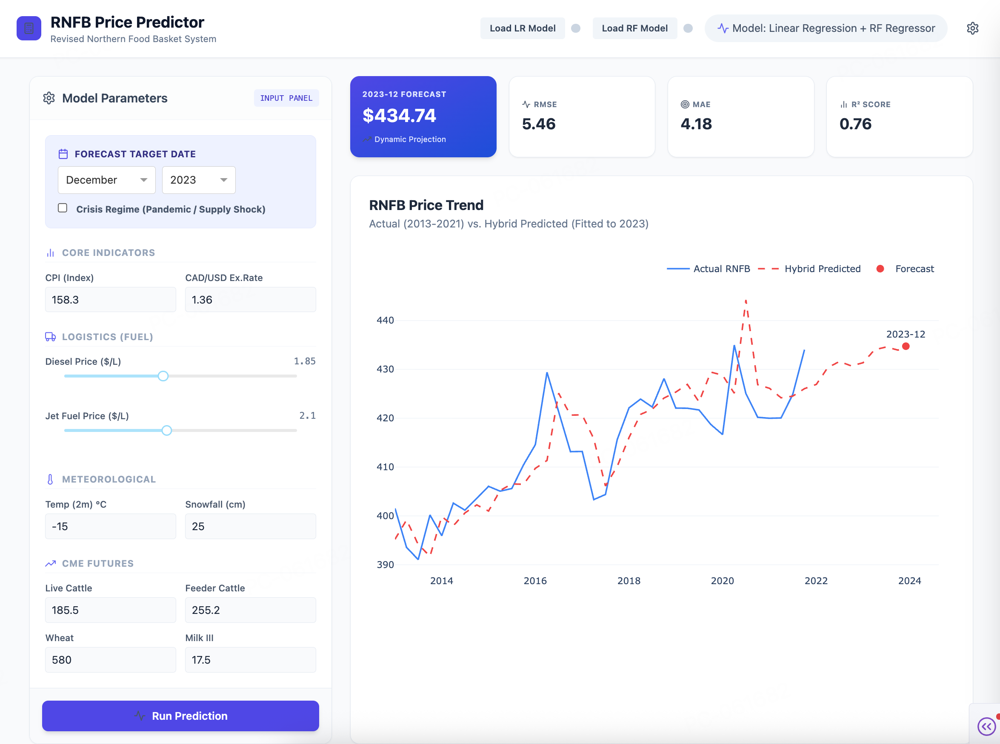

# RNFB Price Predictor Dashboard

The **Revised Northern Food Basket (RNFB) Price Predictor** is a data analysis and visualization tool designed to forecast food basket prices in northern communities. It combines a **Hybrid Machine Learning Model** (Linear Regression + Random Forest) with an interactive **Dash** web application for real-time scenario analysis.



## Project Background
This repository serves as the open-source implementation for a project developed within the **[STEM Fellowship High School Big Data Challenge (HSBDC)](https://www.stemfellowship.org/programs/hsbdc)**.

For a comprehensive walkthrough of the project's methodology and impact, please view the **[Full Project Introduction Video](https://youtu.be/1OjZ4a4el2Q)**.

## Project Structure

### 1. Model Training & Analysis: `rolling_window.py`
This script handles the data processing, feature selection, and model training pipeline.

*   **Data Processing**: Loads cleaned data (`all_samples_clean_final.csv`), handles date indexing, and prepares target (`RNFB_w/out`) and feature variables.
*   **Feature Selection**:
    *   Calculates **Pearson** and **Spearman** correlations to identify top drivers.
    *   Uses **Permutation Importance** within the training loop to select the top 10 most relevant features for the Random Forest residual model.
*   **Hybrid Modeling Approach**:
    *   **Level 1 (Linear)**: A `LinearRegression` model captures the base trend using `CPI_lag_1m`.
    *   **Level 2 (Non-Linear)**: A `RandomForestRegressor` trains on the *residuals* (errors) of the linear model to capture complex, non-linear patterns.
    *   **Hybrid Prediction**: Final prediction = `Linear Prediction` + `RF Residual Prediction`.
*   **Rolling Window Validation**:
    *   Iterates through time with a 12-month rolling window.
    *   Retrains models at each step to simulate real-world forecasting.
    *   Evaluates performance using RMSE, MAE, and R² scores.
*   **Output**: Saves the trained models (`lr_model.pkl`, `rf_model.pkl`) and generates performance plots.

### 2. Interactive Dashboard: `rnfb_dashboard.py`
This is the user-facing application built with **Plotly Dash** and styled with **Tailwind CSS**.

*   **Interactive Simulation**:
    *   Allows users to adjust key drivers (e.g., Diesel Price, CPI, Exchange Rates, Temperature) via sliders and inputs.
    *   Real-time price prediction updates based on user inputs.
*   **Model Management**:
    *   **Load Models**: Users can upload updated `lr_model.pkl` and `rf_model.pkl` files directly through the UI.
    *   **Debug Mode**: A slide-out sidebar displays technical details (coefficients, feature names) of the currently loaded models.
*   **Visualization**:
    *   displays historical price trends alongside hybrid model predictions.
    *   Key metrics (RMSE, MAE, R²) are shown for quick performance assessment.
*   **Responsiveness**: Optimized for various screen sizes (including MacBook viewports) with a compact, non-scrolling layout.

## How to Run

1.  **Install Dependencies**:
    ```bash
    pip install pandas numpy matplotlib seaborn scikit-learn dash joblib
    ```

2.  **Train Models (Optional)**:
    If you need to retrain the models from scratch:
    ```bash
    python rolling_window.py
    ```
    This will generate new `.pkl` files and analysis plots.

3.  **Launch Dashboard**:
    ```bash
    python rnfb_dashboard.py
    ```
    Open your browser and navigate to `http://127.0.0.1:8050/`.

## Key Features
*   **Hybrid Forecasting**: Combines interpretability (Linear) with accuracy (Random Forest).
*   **Dynamic Scenario Planning**: "What-if" analysis for logistical and economic factors.
*   **Winter Road Stress Index (WRSI)**: Measures the strength of essential ice roads for transportation during each winter season.
## Current Status
> [!NOTE]
> **Work in Progress**: The **Hybrid Forecasting** logic is currently utilizing static mock data for demonstration purposes. Full dynamic integration with the trained models is in active development.
